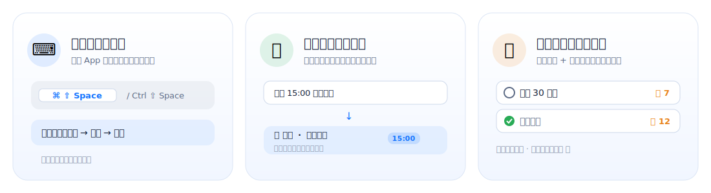

<div align="center">


# 悬浮待办 · Floating Todo

**一个常驻桌面、半透明、始终置顶的跨平台悬浮待办小组件**

> 🪟 **Windows 上也能拥有的高颜值悬浮待办** —— 漂亮的悬浮待办大多只有 Mac，这个 macOS / Windows 都能用，而且免费开源。

专注「今天 / 明天 / 后天」三天，配合「每天打卡」习惯清单、全局快捷键秒记、到点提醒。纯本地、不联网、无广告、无登录。

[](#-下载安装)
[](https://tauri.app)
[](LICENSE)
[](../../releases)
[](../../stargazers)

</div>

---

## ⭐ 如果它帮到了你，请点一个 Star

> 这是一个独立开发者维护的免费开源小工具，**没有任何商业模式、不收集任何数据**。
> 你的一个 ⭐ Star，是我继续更新（修 bug、加功能、做签名）最实在的动力，
> 也能让更多「待办总是忘、又不想用重型 App」的人发现它。**真的，谢谢你！** 🙏

<div align="center">

### 👉 喜欢就点右上角的 ⭐ Star 吧，让这个小项目走得更远 👈

</div>

---

## 📖 这是什么

很多待办 App 太「重」：要登录、要建项目、要切窗口才能看一眼。
**悬浮待办** 反着来——它是一个**永远飘在桌面上、半透明、不打扰**的小浮窗：

- 写文档、开会、敲代码时，它静静停在角落，**一眼看到今天要做什么**；
- 不登录、不联网，**所有数据只存在你自己的电脑里**；
- 只管「今天 / 明天 / 后天」三天，**专注短期执行**，减少规划负担。

<div align="center">

</div>

## 🌟 亮点功能

<div align="center">

</div>

- ⌨️ **全局快捷键秒记**：在任意应用里按 `⌘⇧Space`（Windows 为 `Ctrl+Shift+Space`），浮窗立刻出现并聚焦输入框，打字回车后继续手头的事，零切换。
- ⏰ **自然语言 + 到点提醒**：输入「明天 15:00 提交方案」会自动识别到「明天」分组、设 15:00 提醒，到点弹出系统通知。
- 🔥 **每天打卡连胜**：把习惯设为「每天」常驻待办，完成后累计连续天数（streak），完成时还有撒花动效——把待办和习惯打卡缝在一起。

## ✨ 完整功能

### 待办管理
- 📅 **今天 / 明天 / 后天** 三个独立列表，互不干扰。
- ➕ 快速新增、✅ 一键完成（撒花鼓励）、🗑️ 删除；完成的事自动沉底并保留手动排序。
- 🗣️ **自然语言输入**：识别「明天 / 后天」分组、`15:00` / `下午3点半` 等时间。
- 🔔 **可选时间 + 本地通知提醒**，到点提醒你。
- ✏️ 双击标题即可编辑；更多菜单可编辑、加描述、移到其他日期、设为每天、删除。
- 📝 待办描述里的网址**自动变成可点击链接**。
- 🔁 **每天常驻待办** + 🔥 **连续打卡**：跨天不消失、每天自动重置、连胜计数。
- 🌅 **跨天自动滚动**：明天变今天、未完成顺延到今天底部。
- 🧹 一键清除已完成。

### 窗口与外观
- ⌨️ **全局快捷键**唤起并聚焦输入框；`Esc` 收起。
- 📌 始终置顶；🫧 半透明、透明度可调；🎨 自定义背景色 + 跟随系统/浅色/深色。
- 🖱️ 边缘四角拖拽缩放；缩到最小后一键放大；🔽 紧凑模式只显示今天。
- 🧭 托盘 / 菜单栏小组件，不占任务栏 / 程序坞。
- 🖱️ **鼠标穿透**：开启后浮窗不再挡点击，点击落到下层窗口；可从托盘菜单随时切回来。
- 🚀 **开机自启动**（可在设置里开关）。

### 数据
- 🗒️ **全局备忘录**：一份不随日期切换的便签，自动保存。
- 💾 **导出 / 导入备份**：一键备份成 JSON，换机迁移无忧（纯本地，不上云）。

## 📥 下载安装

前往 [**Releases**](../../releases) 下载对应平台安装包：

| 平台 | 安装包 | 说明 |
|------|--------|------|
| 🍎 macOS (Apple 芯片) | `floating-todo_x.x.x_aarch64.dmg` | M 系列芯片 |
| 🍎 macOS (Intel) | `floating-todo_x.x.x_x64.dmg` | Intel 芯片 |
| 🪟 Windows | `floating-todo_x.x.x_x64-setup.exe` | Win10/11 64 位 |

## ⚠️ 重要：首次打开被系统拦截怎么办

本应用**没有购买付费签名证书**（macOS 99 美元/年、Windows 也需付费证书）。
因此首次打开时系统的安全机制会拦截。**这不是病毒，是因为没签名。** 解决方法：

### 🍎 macOS
若提示「已损坏」或「无法验证开发者」：

- **方法 A（最简单）**：在「应用程序」里找到 **悬浮待办** → **右键 → 打开** → 再点一次「打开」。
- **方法 B（提示"已损坏"时）**：终端执行（会要求输入开机密码，输入时不显示是正常的）：
  ```bash
  sudo xattr -dr com.apple.quarantine "/Applications/悬浮待办.app"
  ```
- **方法 C**：系统设置 → 隐私与安全性 → 找到被拦记录 → 点「仍要打开」。

### 🪟 Windows
若弹出蓝色「Windows 已保护你的电脑 / SmartScreen」窗口：点 **「更多信息」→「仍要运行」** 即可。

> 💡 这些只需做一次。点个 ⭐ Star 支持一下，攒够关注度后我会考虑加上正式签名，免去这些步骤 🙏

## 🛠️ 从源码构建 / 参与开发

```bash
# 前置：Node.js 18+、Rust（https://rustup.rs）
git clone https://github.com/BUG-gao/floating-todo.git
cd floating-todo
npm install
npm run dev      # 开发模式（热重载）
npm run build    # 构建当前平台安装包
```

发布版安装包由 **GitHub Actions** 在打 `v*` tag 时自动构建（macOS + Windows 双平台），见 [`.github/workflows/release.yml`](.github/workflows/release.yml)。

## 🧱 技术栈与架构

- **框架**：[Tauri 2](https://tauri.app)（Rust 后端 + 系统 WebView 前端），安装包小、内存占用低。
- **前端**：原生 HTML / CSS / JavaScript，无打包步骤。
- **持久化**：本地 `localStorage`（纯本地、不联网）。
- **插件**：全局快捷键、系统通知、开机自启、文件对话框。

```
floating-todo/
├─ src/                  # 前端（index.html / styles.css / main.js）
├─ src-tauri/            # Rust 后端、窗口/托盘/快捷键、打包配置
├─ .github/workflows/    # 跨平台自动构建
└─ legacy-macos-swift/   # 早期的 macOS 原生 Swift 版（仅存档参考）
```

## 🗺️ Roadmap / 欢迎贡献

- [ ] macOS 公证 / Windows 代码签名，免去首次打开的拦截步骤
- [ ] 可选的多设备同步（目前坚持纯本地，可先用导出/导入迁移）
- [ ] 自定义全局快捷键
- [ ] 更丰富的自然语言解析（每周重复、相对日期等）

欢迎提 Issue 和 PR！如果你喜欢这个项目，别忘了点 ⭐ Star。

## 📄 License

[MIT](LICENSE) © gaopengfei

---

<div align="center">

**这个小工具帮到你了吗？点一个 ⭐ Star 让它被更多人看到，谢谢！**

</div>
