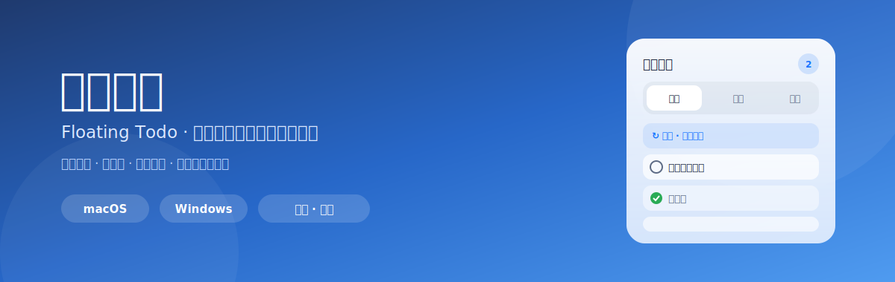
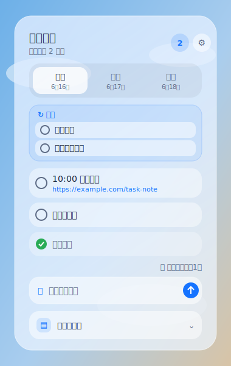

<div align="center">



# 悬浮待办 · Floating Todo

**一个常驻桌面、半透明、始终置顶的跨平台悬浮待办小组件（macOS + Windows）**

用一个轻量浮窗管理今天 / 明天 / 后天的待办，支持「每天」常驻清单、全局备忘录、透明度与背景色自定义。
纯本地、不联网、无广告、无登录。

[](#-下载安装)
[](https://tauri.app)
[](LICENSE)
[](../../releases)
[](../../stargazers)

</div>

---

## ⭐ 如果它帮到了你，请点一个 Star

> 这是一个独立开发者维护的免费开源小工具，**没有任何商业模式、不收集任何数据**。
> 你的一个 ⭐ Star，是我继续更新（修 bug、加功能、做签名）最实在的动力，
> 也能让更多「待办总是忘、又不想用重型 App」的人发现它。**真的，谢谢你！** 🙏

<div align="center">

### 👉 喜欢就点右上角的 ⭐ Star 吧，让这个小项目走得更远 👈

</div>

---

## 📖 这是什么

很多待办 App 太「重」：要登录、要建项目、要切窗口才能看一眼。
**悬浮待办** 反着来——它是一个**永远飘在桌面上、半透明、不打扰**的小浮窗：

- 写文档、开会、敲代码时，它静静停在角落，**一眼看到今天要做什么**；
- 不登录、不联网，**所有数据只存在你自己的电脑里**；
- 只管「今天 / 明天 / 后天」三天，**专注短期执行**，减少规划负担。

<div align="center">

</div>

## ✨ 功能一览

### 待办管理
- 📅 **今天 / 明天 / 后天** 三个独立列表，互不干扰。
- ➕ 快速新增、✅ 一键完成、🗑️ 删除；完成的事自动沉到底部并**保留你的手动排序**。
- ✏️ 双击标题即可编辑；更多菜单可**编辑、加描述、移到其他日期、设为每天、删除**。
- 📝 每条待办可加**描述**（会议链接、备注等），**详情里的网址自动变成可点击链接**，直接打开。
- 🔁 **每天常驻待办**：把「梳理货源」「复盘」这类每天都要做的事「设为每天」，它会固定显示在今天列表顶部，**跨天不消失、每天自动重置为未完成**。
- 🌅 **跨天自动滚动**：过了零点，明天自动变今天、后天变明天；昨天没做完的事顺延到今天底部，不丢工作。
- 🧹 **一键清除已完成**，列表不堆积。

### 窗口与外观
- 📌 **始终置顶**，悬停在普通窗口之上。
- 🫧 **半透明**，透明度可调；写文档时调低不挡正文，任务多时调高方便看。
- 🎨 支持**自定义背景色**，以及**跟随系统 / 浅色 / 深色**三种外观。
- 🖱️ 边缘 / 四角**拖拽缩放**；缩到最小后右上角有**一键放大**按钮。
- 🔽 **紧凑模式**：窗口缩小到一定程度只显示今天内容，最省地方。
- 🧭 **托盘 / 菜单栏小组件**：不占任务栏 / 程序坞，入口在系统托盘（Windows 右下角 / macOS 右上角菜单栏）。

### 备忘录
- 🗒️ **全局备忘录**抽屉：一份不随日期切换的便签，记会议号、临时链接、突发想法；内容自动保存。

## 📥 下载安装

前往 [**Releases**](../../releases) 下载对应平台安装包：

| 平台 | 安装包 | 说明 |
|------|--------|------|
| 🍎 macOS (Apple 芯片) | `floating-todo_x.x.x_aarch64.dmg` | M 系列芯片 |
| 🍎 macOS (Intel) | `floating-todo_x.x.x_x64.dmg` | Intel 芯片 |
| 🪟 Windows | `floating-todo_x.x.x_x64-setup.exe` | Win10/11 64 位 |

> macOS 支持 11+，Windows 支持 10/11。

## ⚠️ 重要：首次打开被系统拦截怎么办

本应用**没有购买付费签名证书**（macOS 99 美元/年、Windows 也需付费证书）。
因此首次打开时，系统的安全机制会拦截。**这不是病毒，是因为没签名。** 解决方法：

### 🍎 macOS
若提示「已损坏」或「无法验证开发者」：

- **方法 A（最简单）**：在「应用程序」里找到 **悬浮待办** → **右键 → 打开** → 再点一次「打开」。
- **方法 B（提示"已损坏"时）**：打开「终端」执行（会要求输入开机密码，输入时不显示是正常的）：
  ```bash
  sudo xattr -dr com.apple.quarantine "/Applications/悬浮待办.app"
  ```
- **方法 C**：系统设置 → 隐私与安全性 → 找到被拦记录 → 点「仍要打开」。

### 🪟 Windows
若弹出蓝色「Windows 已保护你的电脑 / SmartScreen」窗口：

- 点窗口里的 **「更多信息」**，再点 **「仍要运行」** 即可。

> 💡 这些只需做一次。点个 ⭐ Star 支持一下，攒够关注度后我会考虑加上正式签名，免去这些步骤 🙏

## 🛠️ 从源码构建 / 参与开发

```bash
# 前置：Node.js 18+、Rust（https://rustup.rs）
git clone https://github.com/BUG-gao/floating-todo.git
cd floating-todo
npm install
npm run dev      # 开发模式（热重载）
npm run build    # 构建当前平台安装包
```

发布版安装包由 **GitHub Actions** 在打 `v*` tag 时自动构建（macOS + Windows 双平台），见 [`.github/workflows/release.yml`](.github/workflows/release.yml)。

## 🧱 技术栈与架构

- **框架**：[Tauri 2](https://tauri.app)（Rust 后端 + 系统 WebView 前端），安装包小、内存占用低。
- **前端**：原生 HTML / CSS / JavaScript，无打包步骤。
- **持久化**：本地 `localStorage`（纯本地、不联网）。
- **窗口能力**：透明无边框、始终置顶、拖拽缩放、系统托盘，由 `src-tauri` 配置与 Rust 提供。

```
floating-todo/
├─ src/                  # 前端（index.html / styles.css / main.js）
├─ src-tauri/            # Rust 后端、窗口与托盘、打包配置
├─ .github/workflows/    # 跨平台自动构建
└─ legacy-macos-swift/   # 早期的 macOS 原生 Swift 版（仅存档参考）
```

> 项目最初是一个纯 macOS 原生 Swift/SwiftUI 应用（保留在 `legacy-macos-swift/`），现已用 Tauri 重写为跨平台版本。

## 🗺️ Roadmap / 欢迎贡献

- [ ] macOS 公证 / Windows 代码签名，免去首次打开的拦截步骤
- [ ] 待办时间与本地提醒通知
- [ ] 全局快捷键唤起 / 聚焦输入框
- [ ] 多设备同步
- [ ] 点击穿透（让点击落到下层窗口）

欢迎提 Issue 和 PR！如果你喜欢这个项目，别忘了点 ⭐ Star。

## 📄 License

[MIT](LICENSE) © gaopengfei

---

<div align="center">

**这个小工具帮到你了吗？点一个 ⭐ Star 让它被更多人看到，谢谢！**

</div>
